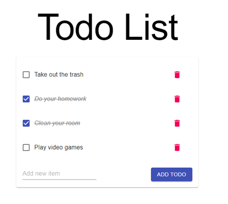

# Todo List

התרגיל הראשון הוא ליצור Todo List. מטרת התרגיל היא להתמקצע בכישורים הבאים:
1.	[JavaScript](https://developer.mozilla.org/en-US/docs/Web/JavaScript)
2.	[React](https://reactjs.org)
3.	[Material-UI](https://material-ui.com/)
4.	[Redux](https://redux.js.org/)
5.	[GraphQL](https://graphql.org/)
6.	[TypeORM](https://typeorm.io/)

המשימה תתחלק ל-3 חלקים, כאשר אחרי כל חלק החופף יעשה לכם code review מלא.

ה-git repo של הפרוייקט נמצא [בTodo-List-Back](https://dev.azure.com/ShaharDigital/CPR/_git/Todo-List-Back) .Azure  [Todo-List-Front](https://dev.azure.com/ShaharDigital/CPR/_git/Todo-List-Front)

את Todo-List-Back תצטרכו רק עבור החלק השלישי, אז אפשר לדלג עליו בינתיים. אבל לפני שתתחילו לעבוד על החלק הראשון, תעשו clone ל  Todo-List-Front
 
### Todo List בסיסי
עליך ליצור Todo List פשוט עם Material-UI. המידע יגיע מקובץ db.ts שקיים כבר בפרוייקט. עליך לממש את התכולות הבאות:

- להציג Todos על המסך

- כפתור מחיקה על Todos

- Checkbox שיחליף את המצב של ה-Todo (נעשה/לא נעשה)

- הוספת Todo

חלוקת קומפוננטות מומלצת:
App / TodoList / TodoItem / AddTodo

**קישורים רלוונטים:**
-	[Tutorial מומלץ על React Todo List](https://www.youtube.com/watch?v=pCA4qpQDZD8)
-	[Material-UI Grid](https://material-ui.com/components/grid/)
-	[Material-UI List](https://material-ui.com/components/lists/)
-	[Material-UI Checkbox](https://material-ui.com/components/checkboxes/#checkbox-with-formcontrollabel)

2.	Using Redux
האפליקציה נראית טוב! אבל כל המידע שלנו מנוהל ב-State. כשנעבוד על מערכת אמיתית זה יהיה מאוד מסורבל מאוד מהר. אנחנו צריכים State Management. הגיע הזמן להוסיף redux לפרוייקט.

אז מה זה Redux בעצם? Redux זאת ספריה שעוזרת לנו לנהל את המידע שאנחנו רוצים לעבוד איתו, כך שיהיה לנו יותר נוח ומסודר לעבוד, המידע יפוזר במערכת שלנו יותר בקלות, ונמנע מבעיות ביצועים שנובעות מניהול מידע לקוי.

נכון לעכשיו, הדרך היחידה שאנחנו מכירים להעביר מידע בין קומפוננטות הוא בעזרת props. אבל מה יקרה אם נרצה להעביר מידע בין 2 קומפוננטות שבכלל לא קשורות אחד לשני? כמובן שנוכל לבעבע את המידע ממקום אחד למעלה עד שנגיע ל-Parent המשותף הראשון, ומשם להעביר חזרה למטה למקום השני. אבל פתרון זה מזוויע מהמון סיבות שאין טעם לפרט עליהן פה. הפתרון הוא State Management. איזשהו ספריה חיצונית שתוכל לספק את המידע ישירות לקומפוננטה שלנו, ושנוכל לשנות את המידע הזה מכל קומפוננטה שנרצה (באחריות כמובן)

במערכת שלנו אנחנו משתמשים ב-Redux, ובתוסף שלו שנקרא Redux Toolkit – שבא להקל אפילו עוד את השימוש ב-Redux.
וכמעט תמיד – המקום הכי טוב להתחיל בו זה הדוקומנטציה. לאחר העמוד הראשון, שבסך הכל מסביר בקצרה על מה זה Toolkit ואיך להוסיף את זה לפרוייקט, תנובתו ל-Basic Tutorial. זה אמנם הרבה טקסט, אבל מאוד מומלץ לקרוא את כל העמוד הזה. בעמודים הבאים מסבירים על המעבר מ-Redux בסיסי ל-Redux Toolkit ולכן זה פחות רלוונטי (אבל בתחתית העמוד של Intermediate Tutorial אולי תמצאו משהו מעניין...)
כעת שלמדנו קצת על מה זה Redux ואיך עושים את ה-Set up שלו, נשאלת השאלה – איך באמת נשתמש בזה בתוך הקומפוננטות שלנו? ובכן יש מספר דרכים. אבל אנחנו נתעסק רק בדרך אחת – Redux Hooks

קישורים רלוונטים:
1.	configureStore
2.	createSlice
3.	Usage with TypeScript
4.	useSelector
5.	useDispatch
3.	Adding a backend
אז יש לנו אפליקציה שעובדת טוב ואפילו משתמשת ב-State Management! אבל היא לא באמת שומרת את הנתונים שלנו... כל פעם שעושים רענן לעמוד הכל נמחק. אנחנו צריכים Database שישמור לנו את המידע
קודם כל – תעשו clone לפרוייקט - Todo-List-Back
עכשיו שיש לנו את ה-Backend. נעבור אתכם בקצרה על הקבצים שכבר קיימים שם (Boilerplate) ועל מה נשאר לכם לעשות. חופף הכדור אצלך
אז מה יש לנו לעשות בעצם?
1.	ליצור API שעונה על המפרט (שכתוב בהמשך)
2.	לשנות את ה-Frontend שלנו כך שיתקשר עם ה-Backend 

שימו לב שהשלב הזה מלא בהמון תכולה. צריך לעשות גם Backend API שלם בטכנלוגיות חדשות, גם להתממשק איתו בפרונט, וגם להחליף את ה-Data flow בפרונט כך שייתחשב בכך שאנחנו מתקשרים עם API. בשל כל זה, מצורף סדר עבודה מומלץ. אחריו יפורט מפרט ה-API והשינויים ההכרחיים ב-Front.

1)	תראו שאתם מצליח לדבר עם ה-db. יש את הקובץ routers/api.ts. תגרמו לכך שבמקום שהוא יחזיר Hello World, שיחזיר מידע כלשהו מה-db. מומלץ לקרוא בדוקומנטציה של TypeORM על פעולות בסיסיות
2)	תעבדו על GraphQL
a.	תשאלו את החופף מה זה Playground / graphiql
b.	תיצרו את ה-GraphQL Schema שלכם לפי המפרט
c.	תגרמו לכך שה-Query יחזיר את המידע האמיתי מה-DB (Resolver)
d.	תגרמו לכך שה-Mutations שלכם יעבדו (מומלץ לשאול פה את החופף. המידע באינטרנט לא הכי ידידותי לתכניתן המתחיל)
3)	ברגע שה-Backend שלכם מוכן (ואתם בטוחים שהוא מוכן, כי הוא עונה על המפרט ובדקתם ב-Playground שהכל עובד כמו שצריך). הגיע הזמן להתחיל לעבוד על הפרונט.
a.	תאתחלו את Apollo client בפרונט
b.	תבקשו את ה-Todos מה-API בעזרת useQuery
c.	תעשו את הקישור ל-Mutations שלכם
3.1. מפרט API
1.	Type Todo – זהה לישות שקיימת ב-DB
id – number
name – string
isCompleted – Boolean
2.	Query Todos – מחזיר מערך של כל ה-Todos ב-DB
3.	Mutation addTodo(name: String!) – מוסיף Todo ל-DB ומחזיר אותו
4.	Mutation toggleTodo(id: Int!) – משנה את מצב ה-isCompleted של Todo מסוים ומחזיר אותו
5.	Mutation deleteTodo(id: Int!) – מוחק Todo מסוים מה-DB. אם הצליח מחזיר true, אחרת - false

